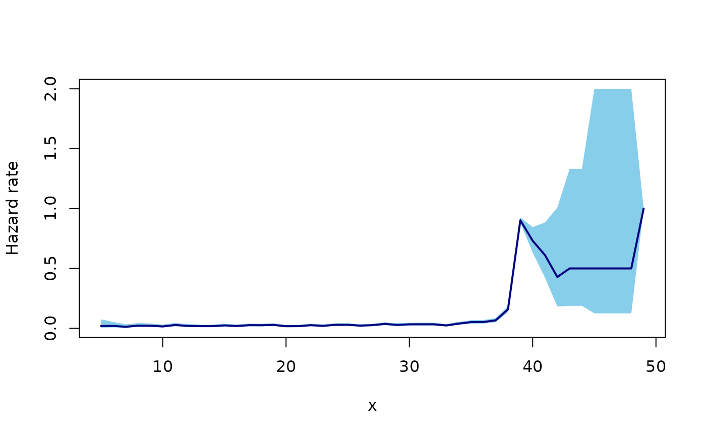
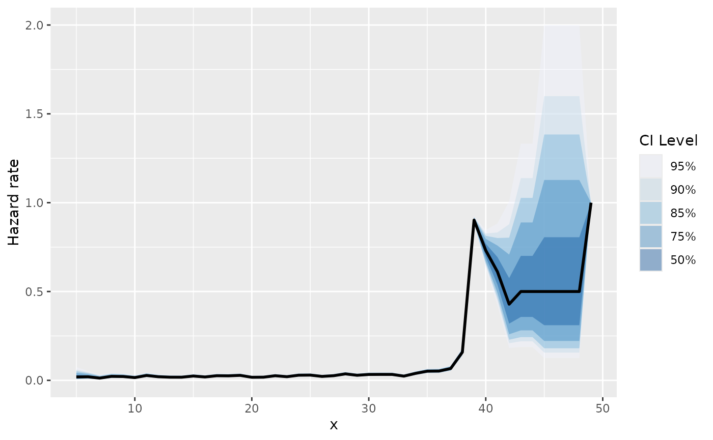
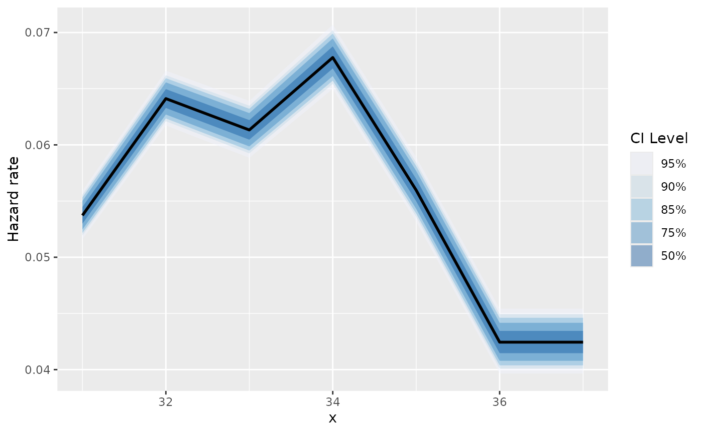
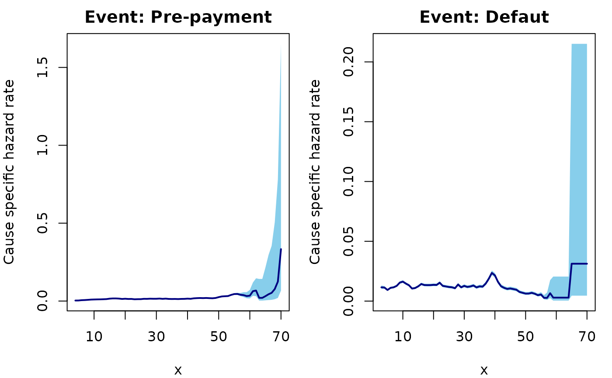
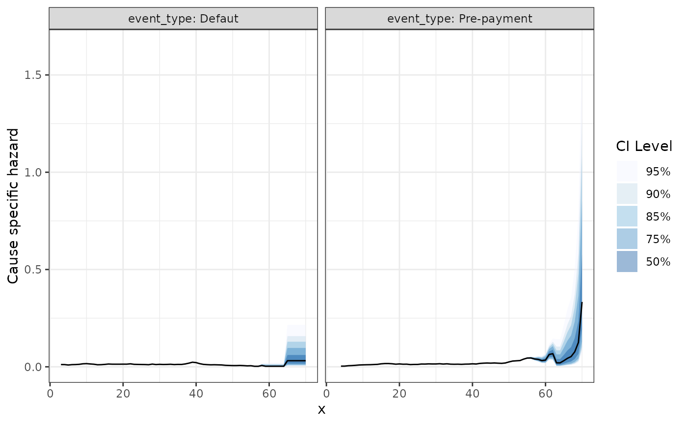

# Get Started

``` r
library(abslife)
#> Welcome to the abslife package!
#> WARNING: Under construction.
library(ggplot2) ## optional
```

> This package is currently under construction!

This vignette demonstrates the core functionalities of the `abslife`
package. `abslife` provides tools for estimation of the hazard rate,
denoted \\\lambda\\, for discrete time-to-event data subject to
**left-truncation** (Jackson P. Lautier, Pozdnyakov, and Yan 2023a). The
package is designed so it can additionally handle the following common
observational data challenges:

- **+ Right-censoring** (Jackson P. Lautier, Pozdnyakov, and Yan 2023b)

- **+ Competing risks** (Jackson P. Lautier, Pozdnyakov, and Yan 2024)

In all cases, asymptotic confidence intervals for the estimated hazard
rates are readily available. The main function of the package is the
[`estimate_hazard()`](http://lcgodoy.me/abslife/reference/estimate_hazard.md)
function, which adapts to these scenarios based on the arguments
provided.

Now, we provide specific examples with datasets shipped with the
package.

### Left-truncation

We begin by analyzing the aart dataset. This dataset represents a
scenario involving only left-truncation. It contains two columns: `Xi`
(time-to-event) and `Yi` (truncation time).

``` r
data(aart)
head(aart)
#>   Xi Yi
#> 1 39 33
#> 2 39 33
#> 3 39 33
#> 4 34 33
#> 5 35 33
#> 6 39 33
```

We estimate the hazard rate using
[`estimate_hazard()`](http://lcgodoy.me/abslife/reference/estimate_hazard.md).

``` r
aart_hazard <- estimate_hazard(lifetime = aart$Xi,
                               trunc_time = aart$Yi,
                               ci_level = 0.95,
                               carry_hazard = TRUE) ## need 
```

> Note that we set `carry_hazard = TRUE`. This argument ensures that if
> a hazard estimate is 0, it is replaced by the last non-zero estimate.

The function returns a `data.frame` containing the evaluation times, the
hazard estimates, and the standard errors (on the log scale). It also
includes the lower and upper bounds of the confidence interval
corresponding to the `ci_level` argument (in this case, set to 0.95).

``` r
tail(aart_hazard)
#> Observed lifetime support: [44, 49] 
#> Total number of timepoints observed: 6
```

#### Summarizing and plotting

For a concise overview of the estimation, use the
[`summary()`](https://rdrr.io/r/base/summary.html) method:

``` r
summary(aart_hazard)
#>    lifetime     hazard se_log_hazard    lower_ci   upper_ci
#> 1         5 0.01904762    0.70034005 0.004827365 0.07515731
#> 6        10 0.01556420    0.35079121 0.007825874 0.03095429
#> 11       15 0.02432778    0.22660796 0.015603194 0.03793077
#> 16       20 0.01724138    0.25596336 0.010439882 0.02847400
#> 21       25 0.02956705    0.18616745 0.020527782 0.04258671
#> 26       30 0.03311966    0.17660603 0.023429257 0.04681803
#> 31       35 0.05163330    0.13912017 0.039310680 0.06781866
#> 36       40 0.73134328    0.07404587 0.632547761 0.84556935
#> 41       45 0.50000000    0.70710678 0.125048827 1.00000000
```

To visualize the hazard rate, you can use base R graphics via the
[`plot()`](https://rdrr.io/r/graphics/plot.default.html) method:

``` r
plot(aart_hazard, ci_level = c(.5, .75, .85, .9, .95))
```



Alternatively, use
[`ggauto()`](http://lcgodoy.me/abslife/reference/ggauto.md) for a
`ggplot2`-powered visualization. This function is particularly useful
for visualizing multiple confidence levels simultaneously:

``` r
ggauto(aart_hazard, ci_level = c(.5, .75, .85, .9, .95))
```



#### Calculating the CDF

The package can also derive the Cumulative Distribution Function (CDF)
directly from the hazard estimates using
[`calc_cdf()`](http://lcgodoy.me/abslife/reference/calc_cdf.md). This
appends a cdf column to the results.

``` r
aart_cdf <- calc_cdf(aart_hazard)
#> Warning in calc_cdf.alife(aart_hazard): Not reporting CDF (and density) values
#> for time points where the hazard rate equals 1.
summary(aart_cdf)
#>    lifetime        cdf      density
#> 1         5 0.01904762 0.0190476190
#> 6        10 0.10628735 0.0141298442
#> 11       15 0.19848679 0.0199852375
#> 16       20 0.28713123 0.0125064696
#> 21       25 0.37058116 0.0191770702
#> 26       30 0.45756023 0.0185808099
#> 31       35 0.54922672 0.0245421009
#> 36       40 0.99118211 0.0240042534
#> 41       45 0.99975506 0.0002449414
```

We can also plot the CDF:

``` r
plot(aart_cdf)
#> Warning in arrows(x0 = ci_data$lifetime, y0 = ci_data$dens_lower, x1 =
#> ci_data$lifetime, : zero-length arrow is of indeterminate angle and so skipped
```


### Right-censoring

The workflow for right-censored data is nearly identical. We will
demonstrate this using the `mbalt` dataset, which includes a third
column, `Di`, serving as the right-censoring indicator.

``` r
data(mbalt)
head(mbalt)
#>   Zi Yi Di
#> 1 37 29  1
#> 2 30 29  1
#> 3 37 30  1
#> 4 32 32  1
#> 5 37 32  1
#> 6 36 33  1
```

We call
[`estimate_hazard()`](http://lcgodoy.me/abslife/reference/estimate_hazard.md)
again, but this time we provide the censoring argument. This argument
accepts a vector where `1` indicates a censored observation and `0`
indicates an observed event.

``` r
mbalt_hazard <- estimate_hazard(lifetime = mbalt$Zi,
                                trunc_time = mbalt$Yi,
                                censoring = mbalt$Di,
                                ci_level = 0.95,
                                carry_hazard = FALSE) ## need 
#> Warning in check_censored(lifetime, censoring_indicator, support_lifetime_rv):
#> Warning: Detected censored observations at the maximum limit of the support
#> (lifetime == max(support_lifetime_rv)). This may lead to identifiability issues
#> or unstable hazard estimates at the tail.
```

The output structure remains consistent with the previous example.

``` r
summary(mbalt_hazard)
#>    lifetime     hazard se_log_hazard   lower_ci  upper_ci
#> 1         5 0.00000000    0.00000000 0.00000000 0.0000000
#> 6        10 0.00000000    0.00000000 0.00000000 0.0000000
#> 11       15 0.00000000    0.00000000 0.00000000 0.0000000
#> 16       20 0.00000000    0.00000000 0.00000000 0.0000000
#> 21       25 0.00000000    0.00000000 0.00000000 0.0000000
#> 26       30 0.00000000    0.00000000 0.00000000 0.0000000
#> 31       35 0.05596574    0.02623112 0.05316113 0.0589183
```

The plotting functions also work out of the box:

``` r
plot(mbalt_hazard)
```


and, for `ggplot2`:

``` r
ggauto(mbalt_hazard, ci_level = c(.5, .75, .85, .9, .95))
```



### Competing risks

Finally, `abslife` can estimate hazards in the presence of competing
risks. We use the aloans dataset, which contains data on consumer
automobile loans (Jackson P. Lautier, Pozdnyakov, and Yan 2024).

``` r
data(aloans)
head(aloans)
#>     risk_cat  Z  Y C D R  bond
#> 1   subprime 42 19 0 0 1 sdart
#> 2   subprime 50 19 0 1 0 sdart
#> 3 near_prime 23 19 0 1 0 sdart
#> 4      prime 70 19 1 0 0 sdart
#> 5   subprime 21 19 0 1 0 sdart
#> 6      prime 70 19 0 0 1 sdart
```

The relevant columns of the dataset for this example are the following:

- `Z`: time to event

- `Y`: left-truncation

- `C`: right censoring indicator

- `D`: Default indicator (1 represents default, and 0 represents
  pre-payment)

The two competing risks in this case are default and pre-payment. To
make the results more interpretable, we create a descriptive event_type
column.

``` r
aloans <- transform(aloans, event_type = ifelse(D == 1, "Defaut", "Pre-payment"))
```

The package is designed so the workflow is identical as the previous two
examples. The only change here is passing the column discriminating the
event types to the `event_type argument` in
[`estimate_hazard()`](http://lcgodoy.me/abslife/reference/estimate_hazard.md).

``` r
aloans_hazard <- estimate_hazard(lifetime = aloans$Z,
                                 trunc_time = aloans$Y,
                                 censoring = aloans$C,
                                 event_type = aloans$event_type,
                                 ci_level = 0.95,
                                 carry_hazard = FALSE) ## need 
#> Warning in check_censored(lifetime, censoring_indicator, support_lifetime_rv):
#> Warning: Detected censored observations at the maximum limit of the support
#> (lifetime == max(support_lifetime_rv)). This may lead to identifiability issues
#> or unstable hazard estimates at the tail.
```

The output now includes a column specifying the event type for each
hazard estimate.

``` r
summary(aloans_hazard)
#>     event_type lifetime      hazard se_log_hazard    lower_ci    upper_ci
#> 1       Defaut        3 0.011520293    0.06431095 0.010155983 0.013067879
#> 2       Defaut        8 0.012729470    0.03827262 0.011809530 0.013721072
#> 3       Defaut       13 0.010477761    0.04439775 0.009604551 0.011430360
#> 4       Defaut       18 0.013350256    0.04167804 0.012303061 0.014486585
#> 5       Defaut       23 0.012722853    0.04578351 0.011630905 0.013917316
#> 6       Defaut       28 0.013859145    0.04665738 0.012647992 0.015186275
#> 7       Defaut       33 0.013032176    0.05157801 0.011779142 0.014418505
#> 8       Defaut       38 0.018664205    0.04593909 0.017057134 0.020422688
#> 9       Defaut       43 0.011084154    0.06514809 0.009755474 0.012593798
#> 10      Defaut       48 0.007673623    0.08449283 0.006502495 0.009055676
#> 11      Defaut       53 0.006133755    0.10337666 0.005008781 0.007511399
#> 12      Defaut       58 0.006600660    0.49834710 0.002485384 0.017529971
#> 13      Defaut       63 0.000000000    0.00000000 0.000000000 0.000000000
#> 14      Defaut       68 0.000000000    0.00000000 0.000000000 0.000000000
#> 15 Pre-payment        3 0.000000000    0.00000000 0.000000000 0.000000000
#> 16 Pre-payment        8 0.007686787    0.04937728 0.006977741 0.008467883
#> 17 Pre-payment       13 0.011646595    0.04208613 0.010724454 0.012648026
#> 18 Pre-payment       18 0.015630141    0.03847409 0.014494849 0.016854354
#> 19 Pre-payment       23 0.011372231    0.04845910 0.010341826 0.012505301
#> 20 Pre-payment       28 0.015052316    0.04474289 0.013788534 0.016431929
#> 21 Pre-payment       33 0.015385696    0.04741284 0.014020363 0.016883988
#> 22 Pre-payment       38 0.013687084    0.05378116 0.012317776 0.015208610
#> 23 Pre-payment       43 0.018648019    0.05003448 0.016906094 0.020569423
#> 24 Pre-payment       48 0.017776306    0.05523028 0.015952524 0.019808592
#> 25 Pre-payment       53 0.032053819    0.04462800 0.029369216 0.034983818
#> 26 Pre-payment       58 0.037953795    0.20451918 0.025419568 0.056668570
#> 27 Pre-payment       63 0.020408163    0.98974332 0.002933141 0.141995624
#> 28 Pre-payment       68 0.076923077    0.96076892 0.011701692 0.505667029
```

The plotting functions work as in the previous examples, handling the
stratification by event type automatically:

``` r
plot(aloans_hazard, ci_level = c(.5, .75, .85, .9, .95))
```



The same holds for the `ggplot2` powered plots:

``` r
ggauto(aloans_hazard, ci_level = c(.5, .75, .85, .9, .95)) +
  theme_bw()
```



## References

Lautier, Jackson P., Vladimir Pozdnyakov, and Jun Yan. 2023a.
“Estimating a Discrete Distribution Subject to Random Left-Truncation
with an Application to Structured Finance.” *Econometrics and
Statistics*. <https://doi.org/10.1016/j.ecosta.2023.05.005>.

———. 2023b. “Pricing Time-to-Event Contingent Cash Flows: A
Discrete-Time Survival Analysis Approach.” *Insurance: Mathematics and
Economics* 110: 53–71.
<https://doi.org/10.1016/j.insmatheco.2023.02.003>.

Lautier, Jackson P, Vladimir Pozdnyakov, and Jun Yan. 2024. “On the
Convergence of Credit Risk in Current Consumer Automobile Loans.”
*Journal of the Royal Statistical Society Series A: Statistics in
Society*, December, qnae137. <https://doi.org/10.1093/jrsssa/qnae137>.
