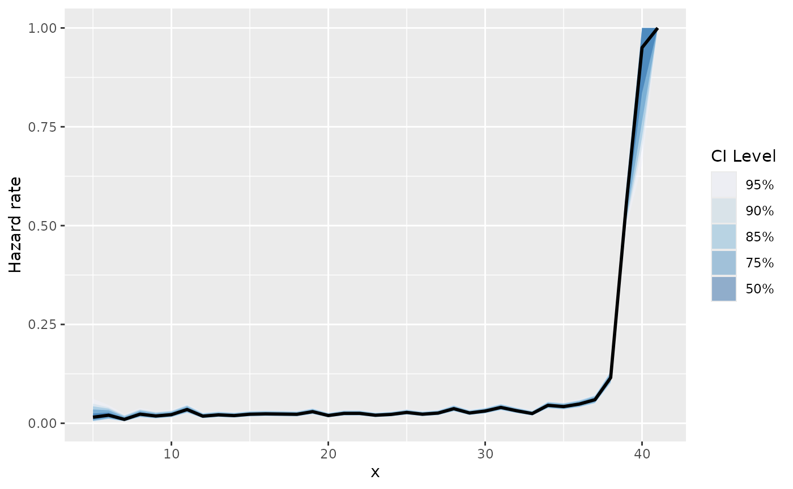
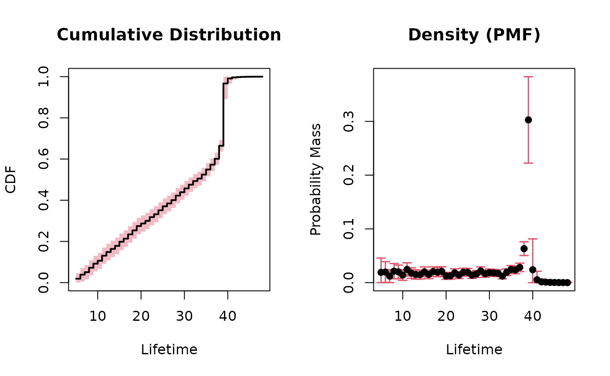
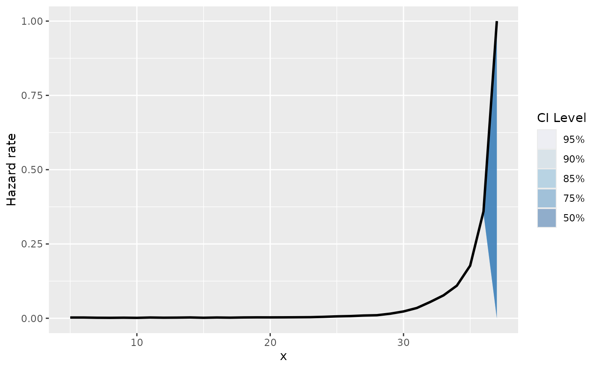
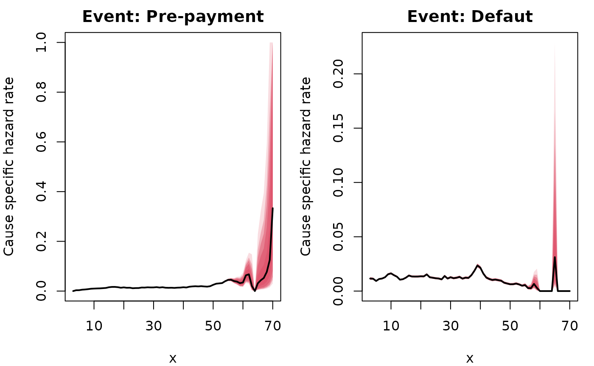
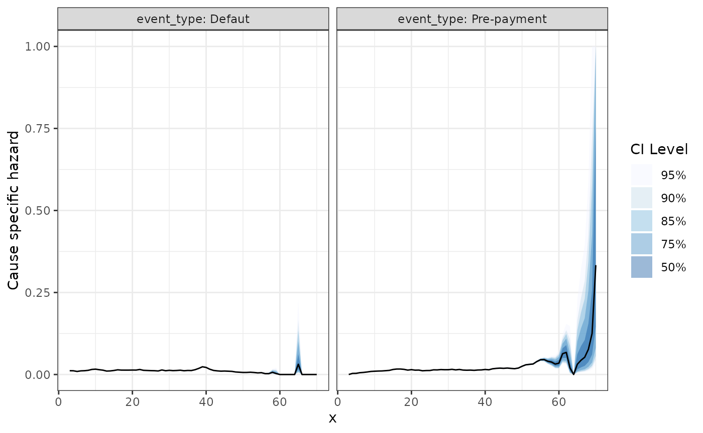

# Get Started

``` r

library(abslife)
#> Warning: S3 methods 'calc_apv.acdf', 'calc_apv.acdf_multi', 'calc_apv.alife',
#> 'calc_apv_var.acdf', 'calc_apv_var.acdf_multi', 'calc_apv_var.alife' were
#> declared in NAMESPACE but not found
#> Welcome to the abslife package!
#> WARNING: Under construction.
library(ggplot2) ## optional
```

> This package is currently under construction!

This vignette demonstrates the core functionalities of the `abslife`
package. `abslife` provides tools for estimation of the hazard rate,
denoted \\\lambda\\, for discrete time-to-event data subject to
**left-truncation** (Lautier et al. 2023a). The package is designed so
it can additionally handle the following common observational data
challenges:

- **+ Right-censoring** (Lautier et al. 2023b)

- **+ Competing risks** (Lautier et al. 2024)

In all cases, asymptotic confidence intervals for the estimated hazard
rates are readily available. The main function of the package is the
[`estimate_hazard()`](http://lcgodoy.me/abslife/reference/estimate_hazard.md)
function, which adapts to these scenarios based on the arguments
provided.

Now, we provide specific examples with datasets shipped with the
package.

### Left-truncation

We begin by analyzing the aart dataset. This dataset represents a
scenario involving only left-truncation. It contains two columns: `Xi`
(time-to-event) and `Yi` (truncation time).

``` r

data(aart)
head(aart)
#>   Xi Yi credit.score interest.rate    pti veh.value co.sign new.used
#> 1 39 33          789        0.0290 0.1138  11.09935       0        1
#> 2 39 33          486        0.0499 0.0000  11.03240       0        1
#> 3 40 34          561        0.0250 0.0000  10.37246       0        1
#> 4 39 33          688        0.0259 0.0555  10.69326       0        1
#> 5 34 33          477        0.0490 0.0000  10.59031       0        1
#> 6 35 33          550        0.0239 0.0000  10.39776       0        1
#>   subvent.rate subvent.cash veh.pick.up veh.suv
#> 1            0            0           0       1
#> 2            0            1           1       0
#> 3            0            0           1       0
#> 4            0            1           1       0
#> 5            0            1           1       0
#> 6            0            0           1       0
```

We estimate the hazard rate using
[`estimate_hazard()`](http://lcgodoy.me/abslife/reference/estimate_hazard.md).

``` r

aart_hazard <- estimate_hazard(lifetime = aart$Xi,
                               trunc_time = aart$Yi,
                               ci_level = 0.95,
                               carry_hazard = TRUE) ## need 
```

> Note that we set `carry_hazard = TRUE`. This argument ensures that if
> a hazard estimate is 0, it is replaced by the last non-zero estimate.

The function returns a `data.frame` containing the evaluation times, the
hazard estimates, and the standard errors (on the log scale). It also
includes the lower and upper bounds of the confidence interval
corresponding to the `ci_level` argument (in this case, set to 0.95).

``` r

tail(aart_hazard)
#> Observed lifetime support: [36, 41] 
#> Total number of timepoints observed: 6
```

#### Summarizing and plotting

For a concise overview of the estimation, use the
[`summary()`](https://rdrr.io/r/base/summary.html) method:

``` r

summary(aart_hazard)
#>    lifetime     hazard se_log_hazard    lower_ci   upper_ci
#> 1         5 0.01538462     0.7126096 0.003850968 0.05940167
#> 6        10 0.02183908     0.2319626 0.013972246 0.03398255
#> 11       15 0.02291826     0.1847030 0.016069256 0.03258974
#> 16       20 0.01963439     0.1875456 0.013677578 0.02811156
#> 21       25 0.02743902     0.1511595 0.020547920 0.03655493
#> 26       30 0.03096539     0.1422477 0.023609106 0.04051868
#> 31       35 0.04223676     0.1212668 0.033602069 0.05296869
#> 36       40 0.95017182     0.1905022 0.929214457 0.96515703
```

To visualize the hazard rate, you can use base R graphics via the
[`plot()`](https://rdrr.io/r/graphics/plot.default.html) method:

``` r

plot(aart_hazard, ci_level = c(.5, .75, .85, .9, .95))
```


Alternatively, use
[`ggauto()`](http://lcgodoy.me/abslife/reference/ggauto.md) for a
`ggplot2`-powered visualization. This function is particularly useful
for visualizing multiple confidence levels simultaneously:

``` r

ggauto(aart_hazard, ci_level = c(.5, .75, .85, .9, .95))
```



#### Calculating the CDF

The package can also derive the Cumulative Distribution Function (CDF)
directly from the hazard estimates using
[`calc_cdf()`](http://lcgodoy.me/abslife/reference/calc_cdf.md). This
appends a cdf column to the results.

``` r

aart_cdf <- calc_cdf(aart_hazard)
#> Warning in calc_cdf.alife(aart_hazard): Not reporting CDF (and density) values
#> for time points where the hazard rate equals 1.
summary(aart_cdf)
#>    lifetime        cdf    density
#> 1         5 0.01538462 0.01538462
#> 6        10 0.10437149 0.01999641
#> 11       15 0.20412422 0.01866792
#> 16       20 0.29434160 0.01413266
#> 21       25 0.37520875 0.01762734
#> 26       30 0.45948868 0.01727198
#> 31       35 0.55198866 0.01975702
#> 36       40 0.99215705 0.14955687
```

We can also plot the CDF:

``` r

plot(aart_cdf)
```



### Right-censoring

The workflow for right-censored data is nearly identical. We will
demonstrate this using the `mbalt` dataset, which includes a third
column, `Di`, serving as the right-censoring indicator.

``` r

data(mbalt)
head(mbalt)
#>   Zi Yi Di base.resid contract.resid co.lessee credit.score location lease.term
#> 1 37 29  1      24708       30139.20     FALSE          848       NJ         36
#> 2 30 29  1      18701       23466.30     FALSE          739       CA         36
#> 3 37 30  1      35571       36383.20      TRUE          871       NY         36
#> 4 32 32  1      30056       32342.76      TRUE          721       OH         36
#> 5 37 32  1      31489       33854.70      TRUE          738       NJ         36
#> 6 36 33  1      29319       30509.46     FALSE          736       CA         36
#>          pti subvented   model year  manufacturer veh.value
#> 1 0.04355511      cash  C300W4 2015 Mercedes-Benz     47090
#> 2 0.06285600      rate CLA250C 2014 Mercedes-Benz     35555
#> 3 0.04434177      none ML350W4 2015 Mercedes-Benz     64120
#> 4 0.04603333      rate ML350W4 2014 Mercedes-Benz     58995
#> 5 0.00514451      rate ML350W4 2015 Mercedes-Benz     60655
#> 6 0.05854000      rate ML350W2 2014 Mercedes-Benz     55600
```

We call
[`estimate_hazard()`](http://lcgodoy.me/abslife/reference/estimate_hazard.md)
again, but this time we provide the censoring argument. This argument
accepts a vector where `1` indicates a censored observation and `0`
indicates an observed event.

``` r

mbalt_hazard <- estimate_hazard(lifetime = mbalt$Zi,
                                trunc_time = mbalt$Yi,
                                censoring = 1 - mbalt$Di,
                                ci_level = 0.95,
                                carry_hazard = FALSE) ## need 
```

The output structure remains consistent with the previous example.

``` r

summary(mbalt_hazard)
#>    lifetime      hazard se_log_hazard     lower_ci    upper_ci
#> 1         5 0.002508511    0.26759709 0.0014862156 0.004231014
#> 6        10 0.001434226    0.20014358 0.0009692981 0.002121686
#> 11       15 0.001737202    0.14599186 0.0013054782 0.002311367
#> 16       20 0.002970186    0.09727315 0.0024558880 0.003591798
#> 21       25 0.006408331    0.06270123 0.0056714682 0.007240233
#> 26       30 0.022951745    0.03238300 0.0215707217 0.024418979
#> 31       35 0.177075260    0.01673112 0.1723472557 0.181904461
```

The plotting functions also work out of the box:

``` r

plot(mbalt_hazard)
```


and, for `ggplot2`:

``` r

ggauto(mbalt_hazard, ci_level = c(.5, .75, .85, .9, .95))
```



### Competing risks

Finally, `abslife` can estimate hazards in the presence of competing
risks. We use the aloans dataset, which contains data on consumer
automobile loans (Lautier et al. 2024).

``` r

data(aloans)
head(aloans)
#>     risk.cat  Z  Y C D R bond orig.apr orig.term orig.loan.amt cur.age
#> 1      prime 36 18 0 0 1 aart   0.0704        72      13649.18      17
#> 2 near_prime 60 17 1 0 0 aart   0.1025        72      19999.10      16
#> 3      prime 28 17 0 0 1 aart   0.0694        72       9098.58      16
#> 4 near_prime 33 17 0 0 1 aart   0.1080        72      11723.36      16
#> 5      prime 60 17 1 0 0 aart   0.0869        72       8753.48      16
#> 6      prime 46 17 0 0 1 aart   0.0560        72      22206.59      16
#>   cur.balance calc.pmt
#> 1    11448.24 231.5438
#> 2    16143.29 368.4643
#> 3     7600.87 153.9386
#> 4     9665.35 218.9605
#> 5     7515.89 155.0285
#> 6    18458.99 362.4058
```

The relevant columns of the dataset for this example are the following:

- `Z`: time to event

- `Y`: left-truncation

- `C`: right censoring indicator

- `D`: Default indicator (1 represents default, and 0 represents
  pre-payment)

The two competing risks in this case are default and pre-payment. To
make the results more interpretable, we create a descriptive event_type
column.

``` r

aloans <- transform(aloans, event_type = ifelse(D == 1, "Defaut", "Pre-payment"))
```

The package is designed so the workflow is identical as the previous two
examples. The only change here is passing the column discriminating the
event types to the `event_type argument` in
[`estimate_hazard()`](http://lcgodoy.me/abslife/reference/estimate_hazard.md).

``` r

aloans_hazard <- estimate_hazard(lifetime = aloans$Z,
                                 trunc_time = aloans$Y,
                                 censoring = aloans$C,
                                 event_type = aloans$event_type,
                                 ci_level = 0.95,
                                 carry_hazard = FALSE) ## need 
#> Warning in check_censored(lifetime, censoring_indicator, support_lifetime_rv):
#> Warning: Detected censored observations at the maximum limit of the support
#> (lifetime == max(support_lifetime_rv)). This may lead to identifiability issues
#> or unstable hazard estimates at the tail.
```

The output now includes a column specifying the event type for each
hazard estimate.

``` r

summary(aloans_hazard)
#>     event_type lifetime      hazard se_log_hazard    lower_ci    upper_ci
#> 1       Defaut        3 0.011520293    0.06506047 0.010155080 0.013066617
#> 2       Defaut        8 0.012729470    0.03876609 0.011809112 0.013720562
#> 3       Defaut       13 0.010477761    0.04486786 0.009604176 0.011429888
#> 4       Defaut       18 0.013350256    0.04224199 0.012302520 0.014485913
#> 5       Defaut       23 0.012722853    0.04637351 0.011630319 0.013916572
#> 6       Defaut       28 0.013859145    0.04731310 0.012647271 0.015185355
#> 7       Defaut       33 0.013032176    0.05225905 0.011778374 0.014417499
#> 8       Defaut       38 0.018664205    0.04681281 0.017055857 0.020421067
#> 9       Defaut       43 0.011084154    0.06587830 0.009754619 0.012592597
#> 10      Defaut       48 0.007673623    0.08514621 0.006501842 0.009054661
#> 11      Defaut       53 0.006133755    0.10401466 0.005008188 0.007510380
#> 12      Defaut       58 0.006600660    0.50165838 0.002479550 0.017451386
#> 13      Defaut       63 0.000000000    0.00000000 0.000000000 0.000000000
#> 14      Defaut       68 0.000000000    0.00000000 0.000000000 0.000000000
#> 15 Pre-payment        3 0.000000000    0.00000000 0.000000000 0.000000000
#> 16 Pre-payment        8 0.007686787    0.04975978 0.006977496 0.008467566
#> 17 Pre-payment       13 0.011646595    0.04258207 0.010724035 0.012647505
#> 18 Pre-payment       18 0.015630141    0.03908499 0.014494211 0.016853574
#> 19 Pre-payment       23 0.011372231    0.04901653 0.010341306 0.012504631
#> 20 Pre-payment       28 0.015052316    0.04542667 0.013787747 0.016430935
#> 21 Pre-payment       33 0.015385696    0.04815372 0.014019446 0.016882814
#> 22 Pre-payment       38 0.013687084    0.05452748 0.012316859 0.015207396
#> 23 Pre-payment       43 0.018648019    0.05098525 0.016904597 0.020567482
#> 24 Pre-payment       48 0.017776306    0.05622984 0.015950891 0.019806416
#> 25 Pre-payment       53 0.032053819    0.04610587 0.029365598 0.034979259
#> 26 Pre-payment       58 0.037953795    0.21258769 0.025348580 0.056464133
#> 27 Pre-payment       63 0.020408163    1.01036297 0.002867406 0.131138926
#> 28 Pre-payment       68 0.076923077    1.04083300 0.010719623 0.390571292
```

The plotting functions work as in the previous examples, handling the
stratification by event type automatically:

``` r

plot(aloans_hazard, ci_level = c(.5, .75, .85, .9, .95))
```



The same holds for the `ggplot2` powered plots:

``` r

ggauto(aloans_hazard, ci_level = c(.5, .75, .85, .9, .95)) +
  theme_bw()
```



## References

Lautier, Jackson P., Vladimir Pozdnyakov, and Jun Yan. 2023a.
“Estimating a Discrete Distribution Subject to Random Left-Truncation
with an Application to Structured Finance.” *Econometrics and
Statistics*, ahead of print.
<https://doi.org/10.1016/j.ecosta.2023.05.005>.

Lautier, Jackson P., Vladimir Pozdnyakov, and Jun Yan. 2023b. “Pricing
Time-to-Event Contingent Cash Flows: A Discrete-Time Survival Analysis
Approach.” *Insurance: Mathematics and Economics* 110: 53–71.
<https://doi.org/10.1016/j.insmatheco.2023.02.003>.

Lautier, Jackson P, Vladimir Pozdnyakov, and Jun Yan. 2024. “On the
Convergence of Credit Risk in Current Consumer Automobile Loans.”
*Journal of the Royal Statistical Society Series A: Statistics in
Society*, December, qnae137. <https://doi.org/10.1093/jrsssa/qnae137>.
